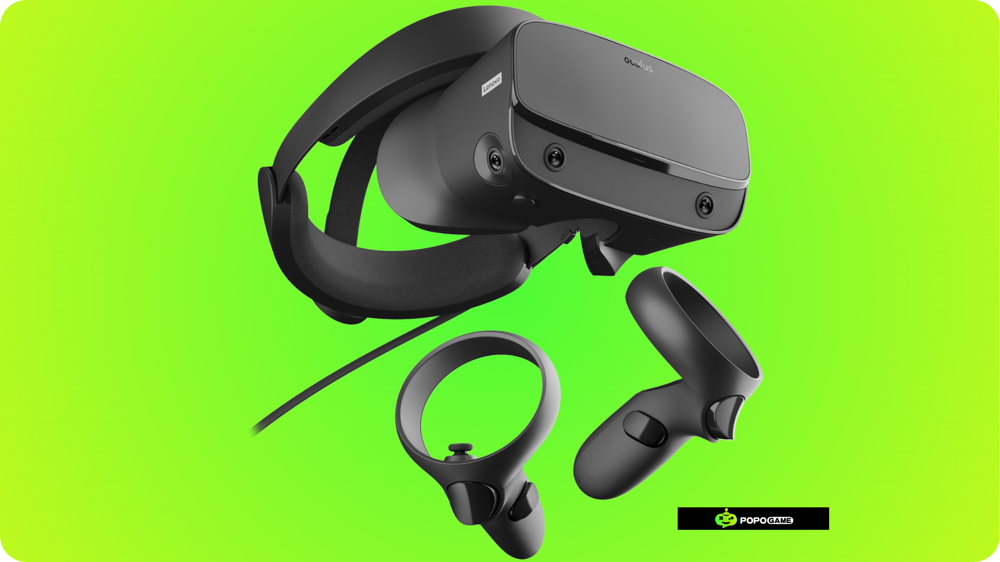

# Introduction to the game platform that can be created in Unity 

Now that you know the usefulness of the Tools and UI of Unity, we will introduce what game platforms or applications can be created in Unity, Unity, as one of the most popular game engines, gives us a very powerful tool to build various types of game platforms. From simple mobile games to complex PC games, everything is likely to be achieved.

## Build Settings

After you have created a new project, Unity will use the windows platform as the development goal. After the project is created , you can open the build settings by accessing the **File -> Build Settings menu.**

Then the build settings which contain a lot of information and configurations that will appear, starting from what scenes are contained in the project you have created, to the Build button which is useful for compiling the project you have created.

Here's a brief explanation of each section of the Build Settings:
**1. Scenes In Build**: The Scenes in Build section of the Unity Build Settings is used to define the scenes to include in your project's build. You can add or remove scenes from this list and set the order in which scenes are loaded when the game is running. This helps manage the scenes required for your project build.
**2. Platform Settings:** The Platform Settings section of the Unity Build Settings is used to view the selected target platform and the type of architecture that your project will run and additional options such as whether to copy a PDB (Program Database) file, create a Visual Studio solution, or enable profiling features (Real-time performance analysis feature).
**3. Platform:** The Platform section in Unity Build Settings is used to choose which Platform the game will run on. By default, only Desktop games can be run but you can download other Platforms by Selecting Platform -> Install with Unity Hub.
**4. Settings:** The Settings section sets how assets (such as images, 3D models, audio, etc.) are imported and processed when you insert them into your Unity project. This allows you to control the quality, size, and format of these assets to suit your project's needs, and then there is a Player Settings button in Unity that is used to configure the app's settings for the target platform, such as resolution, icons, and graphics quality.
**5. Build:** The Build section consists of 2 buttons, namely Build and Build And Run, which both functions are almost similar, Build is used to create an executable file for your project, while Build and Run creates an executable file and immediately runs it on the target platform.
## Platform
By default, Unity provides several platforms that you can choose from through the build settings that have been described earlier. Here are the various platforms that you can choose to target the use of the game you will create.
## Platform Desktop

**1. Windows:** The most common platform for game development. Unity provides full support for a wide range of versions of Windows, from Windows XP to Windows 11.
**2. macOS:** Another popular platform for game development, especially for indie games and games aimed at Mac users.
**3. Linux:** Unity also supports Linux, allowing developers to create games that can run on various Linux distributions.
## Platform Mobile

**1. Android:** The most popular mobile platform in the world. Unity provides excellent support for Android game development, with features such as support for multiple devices, performance optimization, and integration with the Google Play Store.
**2. Apple's mobile platform:** Unity also supports iOS game development, with features such as support for various iOS devices, performance optimization, and integration with the App Store.
## Platform Web 

**1. WebGL:** Unity allows developers to create games that can be run directly within a web browser, without the need to install additional applications. This allows Unity games to be accessed through a variety of devices and platforms.
## Platform VR dan AR

**1. Oculus:** Unity supports VR devices from Oculus, such as Oculus Quest and Oculus Rift.
**2. HTC Vive:** Unity also supports VR devices from HTC, such as the HTC Vive and Vive Pro.
**3. ARKit:** Unity supports Apple's ARKit platform, enabling the development of augmented reality apps for iOS devices.
**4. ARCore:** Unity also supports Google's ARCore platform, allowing for the development of augmented reality apps for Android devices.
